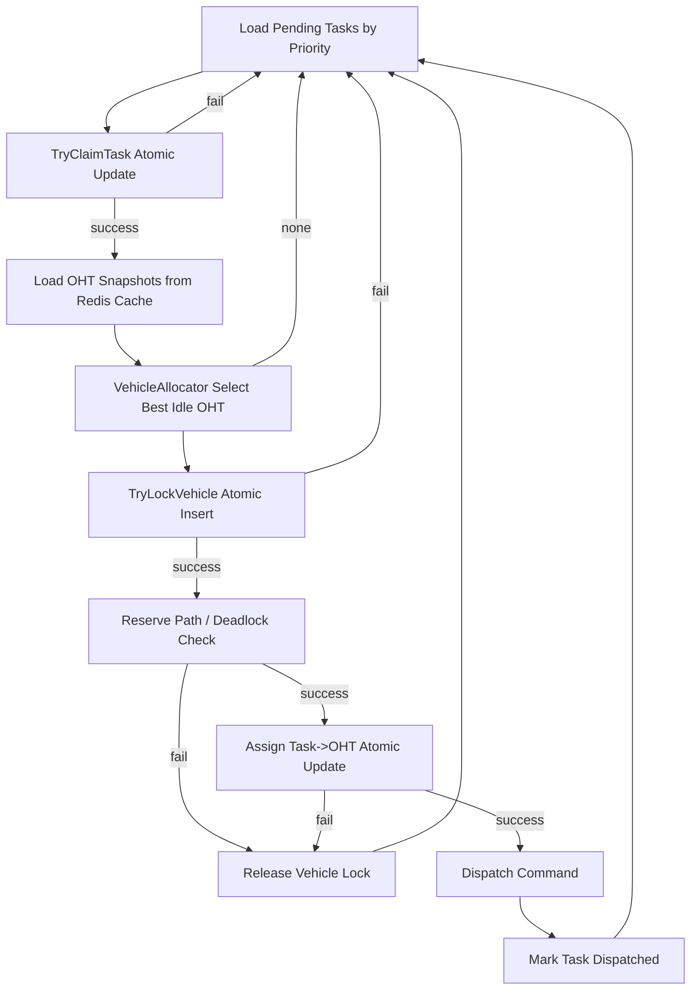

# OHT 调度系统架构设计（.NET 8）

## 1. 系统架构设计

### 1.1 分层
- **Domain**：Point/Segment/OHT 快照/Task 等核心模型。
- **Core**：`GraphEngine`、`PathPlanner`、`VehicleAllocator`、`TaskSchedulerService`、`SnapshotManager`、`ReservationTable`。
- **Infrastructure**：Redis、数据库、派车指令总线（MES/PLC）适配层。

### 1.2 核心职责
1. **GraphEngine**：将 `dicPoints` + `dicSegments` 转换成邻接表图，供高频路径查询。
2. **PathPlanner**：基于 A*（启发式欧氏距离）计算最短“预计时间”路径，支持轨道等级动态成本。
3. **SnapshotManager**：从 Redis Key `OHT:{OhtCode}` 拉取状态并写入本地 `ConcurrentDictionary` 缓存。
4. **VehicleAllocator**：按“空闲 + 最近 + 无冲突”规则选择 OHT。
5. **TaskSchedulerService**：按任务优先级调度，保证多实例并发安全。
6. **DispatchService**：发送任务指令，并更新任务状态。

## 2. 关键算法说明

### 2.1 路径规划（动态预计时间成本）
- 使用 `PriorityQueue<string,double>` 实现 A*。
- 轨道等级：`Normal`（通常）、`Busy`（繁忙）、`Unavailable`（不可用）。
- `g(n)`：起点到当前点的累计预计行驶时间。
- 单段时间：`SegmentTime = Length / Speed`，繁忙段乘惩罚系数（如 `1.6x`），不可用段视为 `+∞` 跳过。
- `h(n)`：欧氏距离 / 默认速度，作为“剩余预计时间”启发式。
- `f(n)=g(n)+h(n)`，最小化总运输预计时间而不仅是几何距离。

### 2.2 车辆分配
- 过滤条件：`OhtStatus.Idle`。
- 目标函数：
  `Cost = Distance(OHT->Source) + Distance(Source->Destination)`。
- 选择 Cost 最小 OHT。
- 调用 `ReservationTable.TryReservePath` 做路径点位预占，避免交叉冲突。

### 2.3 死锁避免
- **预占策略**：派车前锁定全路径关键点。
- **失败回滚**：任意点位预占失败则释放已占点，重新分配。
- **生产建议**：按区段窗口（rolling horizon）预占，降低长路径占用时长。

## 3. Redis + DB 协同方案

### 3.1 Redis（高频状态）
- 存储 OHT 即时状态：`CurrentPoint|Timestamp|CommandCode`。
- `SnapshotManager` 定期 refresh，作为调度读模型。

### 3.2 DB（强一致调度）
- `Tasks` 表字段：`TaskId, Status, Priority, ClaimedBy, AssignedOht, RowVersion...`
- `VehicleLocks` 表字段：`OhtCode, TaskId, LockedAt...`

#### 原子语义（示例 SQL）
```sql
-- 1) claim task
UPDATE Tasks
SET Status = 'Claimed', ClaimedBy = @instance
WHERE TaskId = @taskId AND Status = 'Pending';

-- 2) lock vehicle
INSERT INTO VehicleLocks (OhtCode, TaskId, LockedAt)
VALUES (@oht, @taskId, SYSUTCDATETIME());

-- 3) assign task
UPDATE Tasks
SET Status = 'Assigned', AssignedOht = @oht
WHERE TaskId = @taskId AND Status = 'Claimed';
```
- 通过事务 + 唯一索引（`VehicleLocks.OhtCode UNIQUE`）确保：
  - 一个任务不被多个实例重复处理。
  - 一辆车同一时刻只能分配一个任务。
  - 一个任务只绑定一辆车。

## 4. 高并发优化方案（1000+ OHT / 10000 tasks/min）

1. **读写分离**：Redis 做状态读取，DB 做任务状态写入。
2. **批量调度**：每轮拉取固定批次任务（如 100~1000）。
3. **分区队列**：按区域/工艺段拆分任务队列，减少全局竞争。
4. **缓存拓扑**：轨道图构建一次复用，路径热缓存（source-dest LRU）。
5. **并行候选筛选**：先按区域过滤 OHT，再做精确最短路。
6. **无锁读 + 原子写**：读模型 `ConcurrentDictionary`，写模型 DB 原子更新。
7. **超时恢复**：Claim 超时任务回收，防实例故障导致任务悬挂。

## 5. 调度流程图


